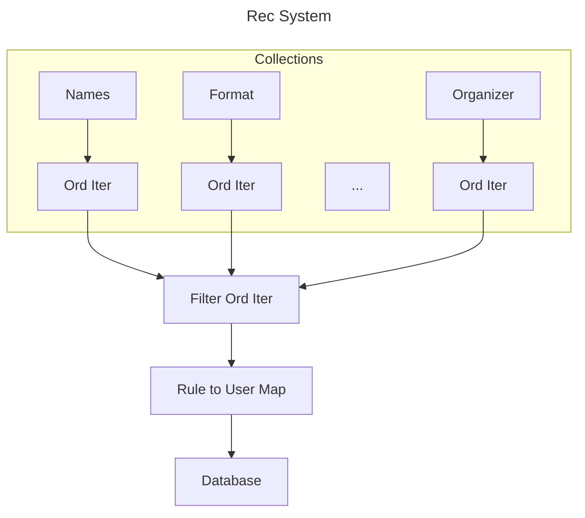

Date: 2023-11-21 19:37

type: #component
links: 

# TL;DR
This is a particular design for the [[tournament rec system]]. This design achieves the rec system's goal by maintaining in-memory data structures to make queries to the whole set of [[tournament rule]]s cheap and efficient.

# About
To start, every rule is decomposed into its constituent [[rule check]]s. Each check is then placed into its corresponding [[check collection]]. Updates to the collections are done by deleting the old check and inserting the new check. Collections provide a method that takes a new tournament and returns an iterator over the rule IDs that match that tournament. The iterator that is returned by a collection must be implicitly sorted (most/all will return an [[ord iter]]).

When the rec system gets a new tournament, it gets an match iterator from each rule collection then zips them together with a [[filter ord iter]]. This iterator will yield only elements that are matches across all rule collections. From here, the rule IDs can be mapped to users IDs. The user IDs can be collected, and then a batch database operation can add the tournament to the [[user profile]]s.
# Example
The overall design of this system can be summarized in the diagram below:
